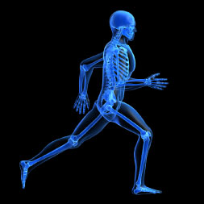

### Why a health coach may be one of your best bets for health.

Let's start by examining why people still hire personal trainers despite so much free info on youtube, webistes, publications, online courses, etc. It starts with accountability.

## Meat

> Accountability is a social contract between two people.  

It aids in the transformation of habit, which is what the term "healthy lifestyle" means.  This habit formed from accountabilty leads to consistency, which is key.

> Consistency is what seperates the good from the great in athletics.  

Being consistent in habits or routines leads to a certain outcome of your actions, like a fitness routine for example.  This outcome is not only seen by you, but celebrated and seen by your health coach/trainer.

> Being seen provides us with the reinforcement we need for the good and the bad days that are inevitable in every journey.  

They say, "two is better than one."  This is true, espeically when trying to reach your goals with so many factors inside and out of our control to either stop or aide us in our goal to reach our peak.

It's apparent that accountability, consistency, and reinforcement are keys to success.  But don't let this one talk be your stop for answers, let's let the evidence present itself about this topic.

## Potatoes

Harvard had a recent study and post about why health coaches are effective and the evidence we now know today.  Click [here](https://www.health.harvard.edu/blog/health-coaching-is-effective-should-you-try-it-2020040819444) to read see this isn't just small talk ;).

## Action

I created this blog to support anyone wanting these three key benefits to improve their health and take charge to obtain our peak in life.  Do you accept the challenge?  Do you want to find out how to reach your peak by an expert healer?  Let's do this together!  Please subscribe and always feel free to reach out!

P.S. I have a companion iOS app in the works and watchOS/iOS watch app to help us on our journey togoether and keep us moving forward daily!  Cheers.